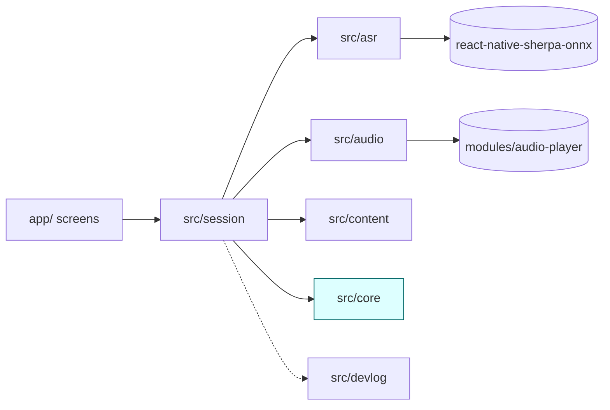
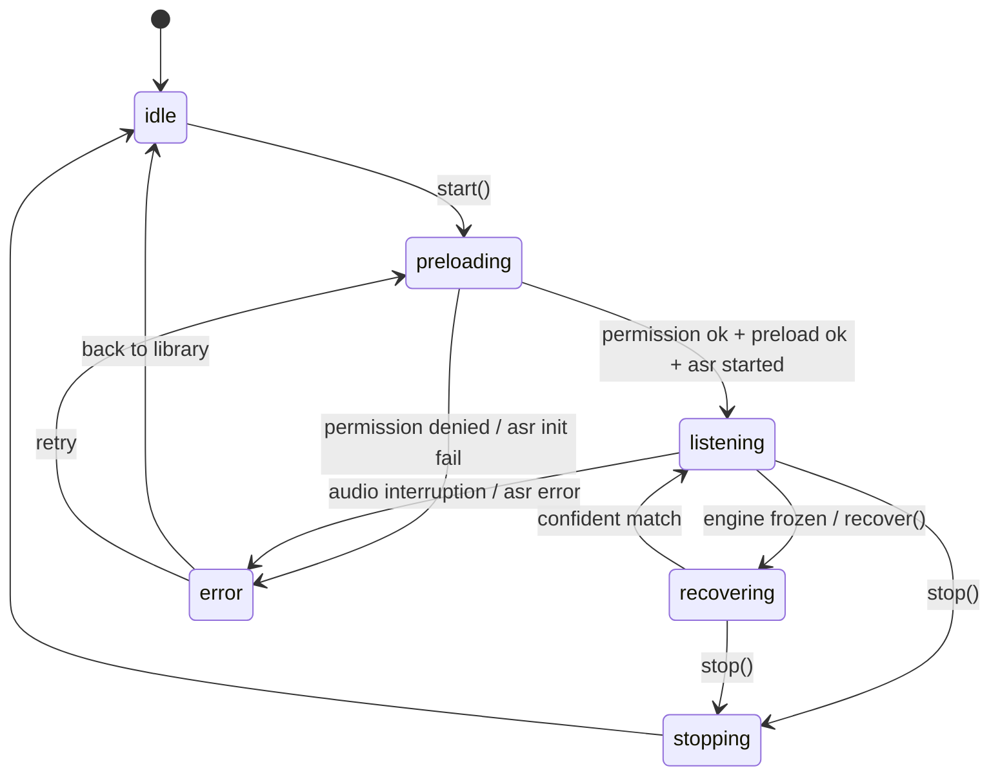

# Book Effect — v1 Architecture

Status: Draft for review. Created June 4, 2026. Second of the gated v1 docs
(PRD → **architecture** → test plan).

This doc defines *how* v1 is built: module boundaries and their interfaces, the native
player contract, data shapes, the content pipeline, error handling, and the cross-platform
strategy. It is the implementation contract for the scope fixed in
[`11-v1-prd.md`](./11-v1-prd.md), grounded in the Phase 2 evidence
([`08`](./08-alignment-replay-results.md), [`09`](./09-audio-latency-results.md),
[`10`](./10-sustained-session-results.md)) and the validated engine in
`phase2/matcher-lab/src/engine/`. v1 code waits until this doc is agreed; the next and final
gated doc is the test plan ([`13`](./13-v1-test-plan.md)).

## 1. Architecture goals

The two product goals from [`00-vision.md`](./00-vision.md) shape the structure:

1. **Family magic** — effects land on the right phrase, nothing fires a page late, and a lost
   place freezes rather than guesses. This is mostly *already solved* in the Phase 2 engine; the
   architecture's job is to productionize it without degrading it.
2. **Learn mobile dev properly** — Expo, native tooling, on-device testing, audio, ASR, TS, clean
   architecture. This justifies real module boundaries and a genuine test story even for a personal
   app. Concretely it drives: a pure-TS engine core with a hard, lint-enforced boundary; exactly one
   thin native module authored the idiomatic Expo way; and an orchestrator that is unit-testable off
   the device.

## 2. Decisions locked for v1

Carried from the PRD + Phase 2 (do not relitigate):

| Area | Decision |
| --- | --- |
| Recognition | Sherpa-ONNX streaming zipformer en-20M (`react-native-sherpa-onnx`). |
| Matcher | Stays in **JS** (P4: p95 ~3.5 ms, ~56× under the 5 Hz / 200 ms frame). No native matcher. |
| Native code | **Exactly one** thin native module: the low-latency one-shot audio player (P6). |
| Acceptance | Qualitative S10 family read-through; Phase 2 numbers are regression/diagnostic references. |
| Stack | Expo prebuild / custom dev client (Expo Go can't run the native ASR/audio libs); TypeScript. |
| Platform | Android-only acceptance gate; architecture cross-platform; iOS is a flip, not a rewrite. |

Settled while brainstorming this doc:

| Fork | Decision | Why |
| --- | --- | --- |
| Project structure | **Single Expo app + pure-TS `src/core/`** | Engine is already framework-free; a lint rule + own test suite buys the hard boundary without Metro-monorepo yak-shaving. |
| Native module authoring | **Expo local module** (`modules/audio-player/`) | Autolinked, survives `prebuild --clean`, typed facade, idiomatic — serves the native-tooling goal. |
| Content pipeline | **Compile to a committed locked `*.book.json`** | `wordIndex` frozen + reviewable in the diff; runtime is a dumb JSON load; validation is a pre-commit gate. |
| Session state | **Framework-free `SessionController` + `useSession` hook** | Few lifecycle states; the engine owns the hard state; controller stays unit-testable off-device. No state-management dependency. |
| Engine `Trigger` | **Audio-agnostic** (no `sound` field on the core type) | Core stays a pure alignment library that fires *ids*; the orchestrator owns the `trigger → sound` binding. Avoids leaking a platform asset concept into core. |

## 3. Module map

Single Expo app at the repo root. Seven modules, each with one job. The dependency rule:
**`src/core` depends on nothing; everything depends inward toward it; platform/native code lives
only at the leaves (`modules/`, the ASR/audio adapters).**

```text
book-effect/
├─ app/                       # UI layer: two screens
│  ├─ library.tsx             #   lists books from content/compiled/index.json
│  └─ session.tsx             #   eyes-free: start/stop, status indicator, full-bleed hidden tap
├─ src/
│  ├─ core/                   # ★ PURE TS — ESLint-banned from importing react-native / expo / *
│  │  ├─ normalize.ts         #   ← lifted verbatim from matcher-lab
│  │  ├─ align.ts             #   ← approxSubstringAlign / phraseEditDistance (Sellers DP)
│  │  ├─ tokens.ts            #   ← charEditDistance / fuzzyTokenEqual
│  │  ├─ editBudget.ts        #   ← editBudget() extracted from fuzzy.ts
│  │  ├─ sessionTracker.ts    #   ← lifted + ONE addition: forceReacquire()
│  │  └─ types.ts             #   Trigger (audio-agnostic), FireDecision, TriggerType, AsrChunk
│  ├─ asr/                    # SherpaAsrEngine behind the AsrEngine interface
│  ├─ audio/                  # AudioPlayer TS facade over modules/audio-player
│  ├─ content/                # loads compiled *.book.json → CompiledBook; the book index
│  ├─ session/                # SessionController (orchestrator) + useSession hook
│  └─ devlog/                 # __DEV__-gated event logger (ring buffer)
├─ modules/audio-player/      # Expo local module: Kotlin (SoundPool) + Swift (AVAudioPlayer pool)
├─ content/
│  ├─ books/<id>/             # AUTHORED source: book.ts + sounds/*.wav  (hand-edited)
│  └─ compiled/               # GENERATED + committed: <id>.book.json, index.json, assets.ts
├─ scripts/build-content.ts   # the content build / validation step (tsx, imports src/core)
└─ vitest.config.ts           # carried over from matcher-lab
```

Dependency direction (an arrow means "imports / depends on"):



`src/core` sits at the center with no outward dependencies — the same property that let it port
cleanly out of `matcher-lab`. The `matcher-lab` replay/bench harness stays in `phase2/` untouched
as the offline regression guard (§11); it imports the same algorithm, so the Phase 2 numbers stay
reproducible after the port.

## 4. The engine port (`src/core`)

The engine is already pure TS with no React Native imports, so this is mostly a copy. Honest
lift-vs-adapt accounting:

### 4.1 Lifted verbatim (only import paths change)

`normalize`, `align`, `tokens`, `editBudget`, and `SessionTracker` itself. The constructor is
already book-agnostic — `new SessionTracker(bookTokens, triggers, opts)` — so **multi-book needs
zero engine change**; the content layer just supplies different tokens. `book.ts` (hardcoded text)
and `readStream.ts` (synthetic stream) are **test/replay fixtures and do not enter the runtime**;
they travel with the test suite only.

### 4.2 The one genuine addition — `SessionTracker.forceReacquire()`

For the hidden-tap recovery (PRD §5.5). Phase 2 validated only *auto* re-acquire (a freeze clears
when a confident forward match advances the cursor). The manual path adds:

```ts
forceReacquire(): void
```

It clears the low-confidence freeze (`lowConfidenceStreak = 0`) and enters a brief **re-acquire
mode**: the next few `process()` calls use a widened `lookAhead` so a reader who advanced (e.g.
turned a page) while the cursor was frozen can be caught **forward**. It **never rewinds** — the
monotonic-cursor invariant is preserved, so this cannot manufacture a wrong-occurrence or a
false-stale fire. This is the single piece flagged for validation in the test plan.

### 4.3 Two boundaries kept, not collapsed

- **Audio-agnostic `Trigger`.** The core type stays `{ id, phrase, wordIndex, type }` — no `sound`.
  The engine knows *positions and phrases*, not assets, and its output (`FireDecision`) already
  speaks only in `triggerId`. The orchestrator owns the `trigger → sound` binding (§5.3, §7) and the
  engine never sees it. This keeps core a pure alignment library and avoids leaking the RN asset
  representation into it.
- **`process()` keeps its signature.** It still accumulates into `tracker.fires`; the orchestrator
  reads the fired-decisions **delta** (`fires.slice(prevLength)`) after each call rather than
  changing the return type — keeping the lift near-verbatim.

### 4.4 The ASR → engine adapter

The engine consumes `AsrChunk { kind, text }` (it ignores the old `wallClock`); the ASR layer emits
`AsrEvent { type, text, timestamp }`. A one-line map in the orchestrator bridges them. The build
step (§5) also **derives `type`** (single-word vs phrase) from token count, so it is never hand-set.

## 5. Runtime contracts

Four interfaces define the seams. All are injected into `SessionController`, so the orchestrator
test runs the **real engine** against **fakes** for everything platform-bound.

### 5.1 ASR (`src/asr`) — carried forward from the spike's `ASRProvider`

```ts
type AsrEvent =
  | { type: 'partial' | 'final'; text: string; timestamp: number }
  | { type: 'vadStart' | 'vadEnd'; timestamp: number }
  | { type: 'error'; timestamp: number; message: string }
  | { type: 'diag'; timestamp: number; stage: string; detail?: Record<string, unknown> };

interface AsrEngine {
  readonly name: string;
  start(onEvent: (e: AsrEvent) => void): Promise<void>;
  stop(): Promise<void>;
  dispose(): Promise<void>;
}
```

`SherpaAsrEngine` is the spike's `SherpaOnnxProvider` carried forward: a 16 kHz mono PCM live stream
feeds `stream.processAudioChunk` on a serial promise queue; a `partial` is emitted when the
recognized text changes, a `final` on endpoint. Model files load from the document directory.

### 5.2 Audio (`src/audio`) — the TS facade of the one native module

```ts
interface AudioPlayer {
  init(opts?: { maxVoices?: number }): Promise<void>;  // polyphony cap = SoundPool maxStreams / iOS pool size
  preload(voices: { id: string; module: number }[]): Promise<void>;  // require() handle → expo-asset URI → native load
  play(id: string): void;          // fire-and-forget, synchronous; overlaps up to maxVoices
  stopAll(): void;                 // stop sounding voices (does not unload)
  teardown(): Promise<void>;       // release native resources at session end
}
```

Native APIs: **Android `SoundPool`** (purpose-built for short preloaded one-shots; `maxStreams`
*is* the polyphony cap, overlap is free) and an **iOS pool of preloaded `AVAudioPlayer`s** (no
`AVAudioEngine` graph needed — no mixing/ducking in v1). `play()` is a synchronous native call so it
sits on the path that hit the ~50 ms target. The facade resolves a `require()` module to a local URI
via `expo-asset` before calling native `preload`, so callers never touch the asset system.

### 5.3 Content (`src/content`)

```ts
type CompiledBook = {
  id: string;
  title: string;
  tokens: string[];   // normalizeWords(text) — the locked wordIndex space
  triggers: { id: string; phrase: string; wordIndex: number; type: TriggerType; sound: string }[];
};
```

The loader reads a committed `*.book.json` (§7). The orchestrator passes `tokens` + `triggers` to
the engine (the extra `sound` field is structurally ignored by the audio-agnostic `Trigger`
parameter) and, from the same array, preloads each trigger's `sound` as a native voice **keyed by
the trigger's `id`** — so a fired `triggerId` plays directly, with no separate runtime map.

### 5.4 Session (`src/session`) — the orchestrator

```ts
type SessionStatus = 'idle' | 'preloading' | 'listening' | 'recovering' | 'stopping' | 'error';
type SessionError = { reason: 'permission' | 'asr' | 'interrupted' | 'unknown'; message: string };

interface SessionController {
  readonly status: SessionStatus;
  readonly error?: SessionError;
  start(book: CompiledBook): Promise<void>;  // permission → preload → asr.start → drive engine
  stop(): Promise<void>;
  recover(): void;                           // hidden tap → tracker.forceReacquire()
  subscribe(listener: (s: SessionStatus) => void): () => void;
}

type SessionDeps = {
  asr: AsrEngine;
  audio: AudioPlayer;
  assets: Record<string, number>;            // sound-path → require() module (the generated registry)
  createTracker: (tokens: readonly string[], triggers: readonly Trigger[]) => SessionTracker;
  log?: DevLogger;
  now?: () => number;
};
```

`useSession` is a thin React hook that subscribes to `SessionController` and hands the session
screen `{ status, error, start, stop, recover }`. The controller is constructed with `SessionDeps`,
so its unit test injects a scripted fake `AsrEngine` + a recording fake `AudioPlayer` + the **real**
`SessionTracker` — no device required.

## 6. Data flow & recovery

```text
mic PCM (16 kHz mono) ─► Sherpa.processAudioChunk ─► AsrEvent (partial on text-change / final on endpoint)
   └► SessionController.onEvent:  adapt → AsrChunk { kind, text }
        └► tracker.process(chunk)              (sync; p95 ~3.5 ms offline; ~56× under a 5 Hz frame)
             └► newFires = tracker.fires delta
                  └► for each: audioPlayer.play(triggerId)                   (sync native call)
        └► status: tracker.frozen ? 'recovering' : 'listening'  → emit → useSession → indicator
```

- **Rate.** No artificial throttle: every changed partial + every final feeds the engine. The
  headroom is large even at a conservative 10× device slowdown (PRD §8.1). If on-device cost
  surprises during validation, coalescing superseded partials within a frame is a one-line future
  lever — not built now.
- **Recovery.** The session screen is a full-bleed invisible `Pressable` (eyes-free — a tap
  *anywhere* recovers) → `controller.recover()` → `forceReacquire()`. Status flips to `recovering`
  and back to `listening` on the next confident match. `expo-keep-awake` keeps the screen on for the
  session duration only, so the tap target stays reachable.
- **Repeated phrases.** When a phrase recurs (e.g. "goodnight"), the engine's nearest-armed-occurrence
  rule fires exactly the active-corridor occurrence (validated P3/P5); authoring disambiguates the
  position via `occurrence` (§7).

The session lifecycle the controller enforces:



`recovering` is a sub-state of an active session driven by **engine** freeze; `error` is a
**lifecycle** failure carrying a `reason` (§9). They are distinct.

## 7. Content pipeline

### 7.1 Authored source

`content/books/<id>/book.ts` (TS, so it is type-checked against `AuthoredBook` and authors get
autocomplete) plus `content/books/<id>/sounds/*.wav`:

```ts
export default {
  id: 'construction-christmas',
  title: 'Construction Site on Christmas Night',
  text: `Down in the big construction site, there's work to do for Christmas night! ...`,
  triggers: [
    { id: 'deadline',     phrase: 'deadline',                     sound: 'sounds/alarm.wav'   },
    { id: 'massive-gift', phrase: 'massive gift',                 sound: 'sounds/sparkle.wav' },
    { id: 'pushes-hard',  phrase: 'pushes hard to clear the way', sound: 'sounds/rev.wav'     },
    // { phrase: 'goodnight', occurrence: 2, ... }  ← occurrence disambiguates a repeated phrase
  ],
} satisfies AuthoredBook;   // NO wordIndex, NO type — both derived by the build step
```

### 7.2 `scripts/build-content.ts` (tsx, imports `src/core`)

Per book:

1. `normalizeWords(text)` → `tokens[]` — the locked `wordIndex` space.
2. Resolve each `phrase` by **exact token-subsequence** match in `tokens` (the book text is ground
   truth — no fuzziness at authoring time). `0 matches → error`; `>1 match and no occurrence →
   error` (ambiguous); else `wordIndex` = index of the first token of the chosen occurrence.
3. Derive `type` from phrase token count (`1 → single-word`, else `phrase`) — drives the engine's
   `maxLookback`.
4. Verify each `sound` file exists → **error** if missing (the primary defense for PRD §5.6's
   missing-asset case).
5. **Lint-warn** (not error) bare single-word triggers — PRD §10's `deadline` fragility, surfaced
   at authoring time.
6. Emit committed `content/compiled/<id>.book.json`, refresh `content/compiled/index.json` (the
   Library list), and stamp a `sourceHash` so a stale artifact (source edited without rebuild) is
   detectable.

### 7.3 Asset bundling

Metro `require()` needs static literals, so the build step also generates
`content/compiled/assets.ts` — static `require()`s keyed by the same `sound` path strings:

```ts
export const assets: Record<string, number> = {
  'construction-christmas/sounds/alarm.wav': require('../books/construction-christmas/sounds/alarm.wav'),
  // ...regenerated whenever a book is rebuilt
};
```

The audio facade resolves a `sound` string → module (via this registry) → local URI (via
`expo-asset`) before native `preload`. This matches the P7 reality: in the dev build URIs resolve
over `adb reverse`, so the "preload while plugged" rule still holds; release bundles them. Adding a
book = drop files + rebuild; the registry regenerates, no hand-wiring.

## 8. Error handling

The active-session indicator (`listening` ⇄ `recovering`) reflects **engine** state
(`tracker.frozen`); `error` is the **lifecycle** failure state and carries a `reason`. Mapping of
PRD §5.6:

| Failure | Handling | Result |
| --- | --- | --- |
| **Mic permission denied** | `start()` requests permission first; on deny → recoverable message + retry; never reaches `preloading`; no crash | `error{permission}` |
| **Audio interruption** (call/alarm) | ASR/native surfaces focus loss (Android AudioFocus / iOS AVAudioSession); controller stops gracefully (`asr.stop`, `audio.stopAll`); reader restarts or recovers | `error{interrupted}` |
| **Recognizer / model-load failure** | `asr.start()` rejects or emits an init `error`; message on the session screen; **"Back to Library" always available** | `error{asr}` |
| **Missing / corrupt asset** | Build-time = build fails (§7.2 step 4). Runtime defense-in-depth: `preload` skips a failed voice (logs, no throw); `play(id)` of an unloaded id is a **no-op** | stays `listening` |

Net: a single bad asset costs one silent effect, never the session; every other failure is
recoverable without a crash and always keeps the route back to the library.

## 9. Cross-platform strategy — keeping iOS a flip

Everything in `app/` and `src/` is platform-neutral TS: **no `Platform.OS` branching in app logic,
no Android-only JS APIs.** Sherpa (`react-native-sherpa-onnx`) and the Expo permission / keep-awake
APIs are already cross-platform. The *only* platform-specific code is `modules/audio-player/`
(Kotlin + Swift behind the one TS facade). So the iOS flip is a documented checklist that touches
**zero JS**:

1. Implement / verify the Swift `AVAudioPlayer`-pool side against the existing `AudioPlayer` contract.
2. Produce an iOS dev-client build.
3. Run the P6/P8 acoustic-latency check on the iPhone 12 (the ~1 s target).

Gated only on Mac / device access — a follow-on, not a v1 gate (PRD §3, §7).

## 10. Dev-only observability

`src/devlog` is the spike's `EventLogger` ring buffer, **`__DEV__`-gated** (compiled out of release →
zero product-UI, zero release cost), with the cap raised / a periodic flush (fixes P7 caveat #2 — the
500-event cap truncated the long-session record). It records ASR events, per-`process()` engine
signals (cursor index, `frozen`, fires), and **per-`process()` `performance.now()` timing**.

This is how the PRD §8 open validation items are observed **without a product-UI overlay** (PRD §3,
§9):

- **§8.1 on-device engine cost on the S10** — the per-`process()` timing in the dev log.
- **§8.2 15–20 min battery run** — adb battery reads at session ends (the P7 method).
- **§8.3 iPhone 12 latency** — the P6 acoustic-capture probe, carried forward.

Logs are written to app cache and pulled via `adb run-as` (the established Phase 2 device-capture
flow). All numbers come from this path; the session screen shows only the listening/recovering
indicator.

## 11. Testing strategy (sketch — the test plan owns the detail)

The architecture's testability seams; [`13-v1-test-plan.md`](./13-v1-test-plan.md) turns these into
the plan.

- **`src/core`** — vitest, the lifted Phase 2 tests + new `forceReacquire` tests. Pure, fast,
  RN-import-banned.
- **Content build** — resolution unit tests (found / not-found error / ambiguous-needs-occurrence /
  single-word lint / missing-asset error) + a golden compiled artifact for the acceptance book.
- **`SessionController`** — vitest with a scripted fake `AsrEngine` + a recording fake `AudioPlayer`
  + the **real** `SessionTracker`: assert fire sequence, status transitions, recovery, and each
  error path (the `SpikeSession.test.ts` pattern).
- **Native module** — thin; covered by the on-device P6 latency probe + manual checks (JS-side
  latency can't be unit-tested).
- **Offline regression guard** — the `matcher-lab` `replay` / `replay:human` / `bench` harness, run
  against the compiled book + recorded Phase 2 streams, confirms the *ported* engine still
  reproduces the Phase 2 numbers (≥95% in-corridor, 0 false-stale, 0 wrong-occurrence) after the lift.
- **On-device** — the qualitative S10 family read-through (the real acceptance gate, PRD §7) + the
  §10 dev-log validation runs.

## 12. Risks / watch-items carried into the test plan

- **`forceReacquire()` is new** (§4.2) — not exercised in Phase 2; needs its own tests and an
  on-device feel check.
- **On-device JS-thread cost** (PRD §8.1) — offline numbers are strong but not yet confirmed on the
  S10 contending with Sherpa + UI; measured via §10.
- **Single-word trigger fragility** (PRD §10) — recognition-layer, out of engine scope; mitigated by
  the build-step lint warning, not an architecture change.
- **Battery over a full session** (PRD §8.2) — current data is ~9 min; the 15–20 min confirmation is
  a §10 dev-log run.

## 13. References

- PRD (scope contract): [`11-v1-prd.md`](./11-v1-prd.md)
- Vision: [`00-vision.md`](./00-vision.md)
- Phase 2 runbook / gates: [`06-phase-2-runbook.md`](./06-phase-2-runbook.md)
- Evidence: matcher [`08`](./08-alignment-replay-results.md), audio
  [`09`](./09-audio-latency-results.md), sustained read [`10`](./10-sustained-session-results.md)
- Validated engine to productionize: `phase2/matcher-lab/src/engine/`,
  `phase2/matcher-lab/src/matchers/`
- Glossary: [`02-glossary.md`](./02-glossary.md)
- Next gated doc: [`13-v1-test-plan.md`](./13-v1-test-plan.md)
